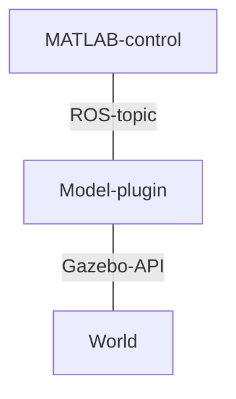
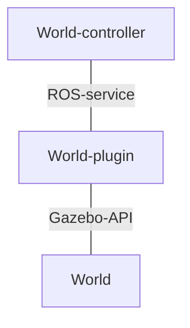

# Descripción del nuevo simulador

## Control de la aeronaves
Cada una de las aeronaves en vuelo dispone de un identificador único para esa simulación. Dado que este identificador es único, podemos hacer referencia a una aeronave en cualquier momento sin ambiguedad. Dado que la simulación y el control de la nave se hacen por separado, se hace uso de ROS y su red para comunicar ambas partes. Cada uno de los UAV dispone de un tópico, siguiendo una estructura definida, incluyendo su identificador único, donde se comunicará toda la información necesaria para el control y la navegación. Es decir, este tópico representa la comunicación existente, sea cual sea, entre los servicios U-space y el controlador de la aeronave.

El diagrama de implementación sería el siguiente: el control creado en MATLAB se comunicará, a través del tópico, con el plugin del modelo. Este plugin, creado en C++, accede a través de la API de Gazebo al modelo con el que se asocia en el mundo, permitiendo modificarlo y realizar todas las acciones implementadas en el plugin.  

## Control de la simulación
Se debe disponer de un "dios" en el mundo, que permita añadir o elimnar objetos en el mismo, así ciomo añadir o eliminar aeronaves durante la simulación. En este caso, se debe disponer de un "controlador del mundo", que será el que se encarge de "señalizar" cuando una aeronave o un objeto debe ser añadido o eliminado del mundo. En este caso, la comunicación entre el "controlador del mundo" y el plugin que se encarga de modificarlo no se realizará entre tópicos, si no a través de servicios, que trabajan con un modelo petición-respuesta, donde se informa al "controlador del mundo" cuando la operación ha acabado, pudiendo adjuntar información relativa al proceso.

