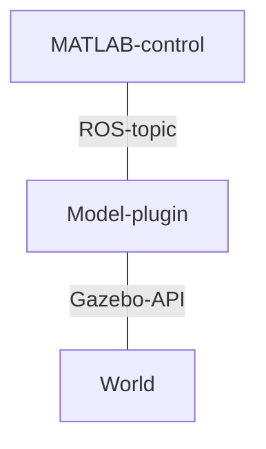

# Descripción del nuevo simulador

## Control de la aeronaves
Cada una de las aeronaves en vuelo dispone de un identificador único para esa simulación. Dado que este identificador es único, podemos hacer referencia a una aeronave en cualquier momento sin ambiguedad. Dado que la simulación y el control de la nave se hacen por separado, se hace uso de ROS y su red para comunicar ambas partes. Cada uno de los UAV dispone de un tópico, siguiendo una estructura definida, incluyendo su identificador único, donde se comunicará toda la información necesaria para el control y la navegación. Es decir, este tópico representa la comunicación existente, sea cual sea, entre los servicios U-space y el controlador de la aeronave.
